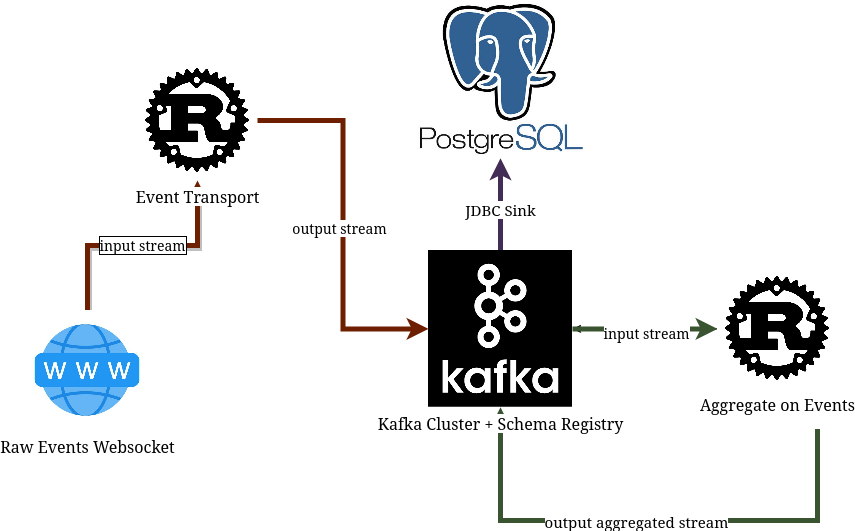

# Aggregate Kafka Streams in Rust 

## Description
This project contains a solution for the technical assignment provided by **D2X**. The text version of the assignment can be accessed in [this pdf file](./resources/D2X-DataStreamingAssignment.pdf). In brief project is supposed to set up a streaming processing application in Rust that can:
- gather raw events as they come in from a web socket source  into the Kafka queue
- pull data out from raw events and compute a metric over the period (i.e. Moving Average)
- add a sink that would stream raw events using the JDBC driver to Postgres for persistence

Stack composition should end up similar to:


### Problem Statement
Set up multiple cross-functional services that should be easily deployed using Docker and isolated from each other to manage growing complexity. Decouple functionality to facilitate integration and deployment. The end product should be a reliable stream aggregation tool that can be quickly adopted for use cases outside of a given task where latencies and development speed matter. Software code should be easy to read and follow to deliver sustainability.

This project is useful to quickly pick up on Kafka, and Rust development as it can be used as a showcase for quickly launching consumers/producers in a close to production-ready environment. Good to experiment with, develop your own features, and save time to find a state-of-the-art solution. 

### Core Functionality
- Raw event transport microservice producer to Kafka   
- PostgreSQL sink consumer for persisting raw events
- Aggregate producer to Kafka
- Monitoring tools (latencies, admin for Kafka, Postgres)
- Support for websocket input raw event stream
- Docker-compose as IaC for a productive environment

### Additional Features
- Support for a backward-compatible Schema Registry
- Usage of Avro serializers to improve storage and transport costs
- Lightweight Rust binaries (for raw microservice - `29.4MB`, for aggregator - `24.2MB`) 
- Fairly small codebase, most of the functionality decoupled into a shared Rust library
- Tracing for read/write Kafka latencies that could be accessed in Zipkin

### ToDo
- [] Integrate Graphana to display metric dashboards in real time
- [] Cover code with tests, and more extensive documentation; Saves time later on
- [] Better handling of environment variables, current setup for Rust services requires toml files
- [] Prometheus metric exporter for KafkaConnect (JDBC sink), microservices (stats for CPU, mem)
- [] Aggregator microservice requires additional testing to identify (buffer size, and performance on multiple consumers)
<!-- - [] Write more efficient code in Rust, some aspects of tokio, ownership are still not fully there -->

## Installation

```bash
make run
```

or the usual:

```bash
docker-compose up
```

## Project Structure
Due to the fact that the repo uses docker-compose, the organization is as decoupled as possible. For root directories - **config** is used to declare environment variables during the launch, while the **services** folder contains the actual implementation of Rust microservices.  
```
├── config
│   ├── agg-producer
│   ├── raw-consumer-jdbc-sink
│   └── raw-producer
└── services
    └── kstream-agg-rs
        └── src
            ├── bin
            │   ├── agg-producer
            │   └── raw-producer
            └── lib.rs
```
### Config
Configuration folder stores setup tools to run three services:
* PostgreSQL Sink Kafka Consumer (*raw-consumer-jdbc-sink*)  with [event-pg.json](config/raw-consumer-jdbc-sink/raw-pg.json) to setup postgres and input kafka configuration

* Raw event from websocket service (*raw-producer*) uses [default.toml](config/raw-producer/config/default.toml) to setup Deribit request handle and Kafka producer options, also it declares docker [build](config/raw-producer/Dockerfile) 

* Event aggregation service (*agg-producer*) uses [default.toml](config/agg-producer/config/default.toml) to setup options for raw event  and output Kafka topic, and docker [build](config/agg-producer/Dockerfile)

More context regarding dockerfile for Rust services is addressed in the readme of the [common crate](services/kstream-agg-rs/).

### Services
It contains a single cargo library crate [kstream-agg-rs](services/kstream-agg-rs/) that is used by both `raw-producer` and `agg-producer`. This shared library allows to have nearly one-file binary declaration without code duplication from creating two separate crates.

## Infrasture Considerations
Main declarations for infrastructure are in [docker-compose.yml](./docker-compose.yaml), some that should change more often can be found in [./docker-compose.override.yaml](./docker-compose.override.yaml).

### Kafka Connect
One of the requirements for this task was to persist raw inputs to the PostgreSQL database, so it was a choice between writing a Rust application with tools similar to `pgx` or using ready-to-go solutions such as Kafka Connect. After carefully considering requirements I made a choice to go with JDBC consumer sink for the following reasons: written in Java (not too slow, supports JMX), database agnostic (can switch to MySQL, S3, ElasticSearch) by changing default configuration, supports replication, fault-tolerance.

### pgAdmin
Popular open-source tools to monitor and manage databases can be used to see I/O, create tables, etc. Decent for debugging and helps to achieve seamless integration of Kafka Connect.


### Redpanda Console
UI to check clusters, brokers, topics and partitions. Displays monitor consumers and consumer lag, Schema Registry, and allows management of connectors and Kafka Connect clusters.


### AKHQ
Another tool for Kafka, similar to the redpanda console, but more minimalistic GUI. Features are pretty much the same: Schema Registry, live trail for offsets, manage connectors, topics data, and consumer groups.

